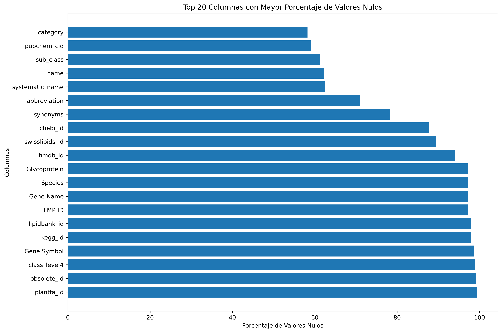
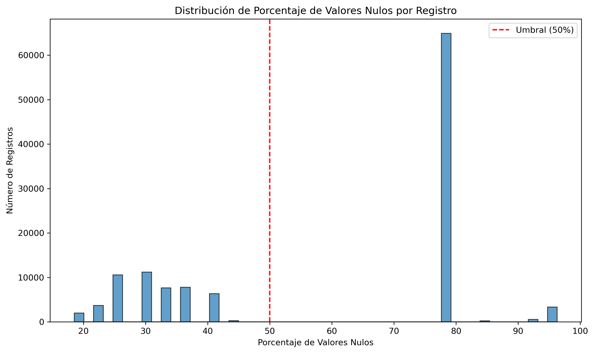

#  Minería de Datos de Lípidos  

Este proyecto tiene como objetivo **unificar, analizar y limpiar bases de datos de lípidos** para obtener un recurso propio, completo y depurado, listo para análisis posteriores.  

La idea principal es construir un **pipeline reproducible** que permita:  
- Recolectar información de múltiples fuentes.  
- Integrar datos en un solo archivo maestro.  
- Analizar su calidad y estructura.  
- Depurar y normalizar los datos para usos en investigación y análisis bioinformático.

## 🧾 Procedimiento Paso a Paso  

### 1️⃣ Búsqueda y Descarga de Bases de Datos  
- Se realizó una búsqueda de información sobre lípidos en bases de datos especializadas.  
- Fuentes utilizadas:  
  - [Glycosmos](https://glycosmos.org/)  
  - [LIPID MAPS® LMSD](https://www.lipidmaps.org/)  
- Se descargaron todas las bases de datos disponibles de las fuentes seleccionadas.

### 2️⃣ Creación de la Base de Datos Unificada  
- Se desarrolló un script en Jupyter Lab llamado **`creation_databank.ipynb`** con la ayuda de DeepSeek.  
- Este script integró todas las bases de datos descargadas y generó una base de datos unificada en formato **CSV**.  

📁 **Archivo resultante:**  
`unified_lipid_database.csv`  

📊 **Reporte de Unificación:**  
- **Total de registros:** `118,462`  
- **Total de columnas:** `37`  
- **Registros por fuente:**  
  - nan → 0 registros  
  - comp_db → 64,891 registros  
  - lipiglu → 3,325 registros  
- **Primeras 10 columnas:**  
  `['lm_id', 'inchi_key_lipidmaps', 'smiles_lipidmaps', 'obsolete_id', 'source_lipidmaps', 'name', 'systematic_name', 'category', 'main_class', 'exact_mass']`

📌 **Lugar para gráfica:**  
Incluye aquí un **diagrama de flujo** del proceso de unificación o una captura de las primeras filas de la base de datos usando Pandas (`df.head()`).

---

### 3️⃣ Análisis Inicial de la Base de Datos  
- Se ejecutó el script **`analysis_databank.ipynb`** para:  
  - Identificar columnas vacías.  
  - Detectar datos incompletos o fuera de lugar.  
  - Generar estadísticas iniciales.  

📁 **Archivo resultante:**  
`enhanced_lipid_database.csv`  

## 📊 Distribución de Valores Nulos

   
  <em>Análisis general de valores nulos</em>

   
  <em>Distribución de valores nulos por registro</em>

   
  <em>Análisis de nulos remanentes después de la limpieza</em>

---

### 4️⃣ Limpieza y Depuración de Datos  
- Se utilizó el script **`cleaned_databank.ipynb`** para:  
  - Eliminar registros duplicados, vacíos o inconsistentes.  
  - Corregir formatos y nombres de columnas.  
  - Documentar los datos eliminados.  
  - Generar estadísticas y gráficas sobre valores nulos antes y después de la limpieza.  

📁 **Archivo resultante:**  
`cleaned_lipid_database.csv`  

resultados 
=== RESUMEN EJECUTIVO ===

Base de datos original:
- Registros: 118462
- Columnas: 37

Después de la limpieza:
- Registros: 49466 (41.76% retenidos)
- Columnas: 27 (72.97% retenidas)

Eliminados:
- 10 columnas con >95% de valores nulos
- 68996 registros con >50% de valores nulos

La base de datos limpia se ha guardado en: /home/edwin/proyectos/spent_coffee_grounds/lipids/raw/databases/cleaned_lipid_database.csv
El reporte detallado se ha guardado en: /home/edwin/proyectos/spent_coffee_grounds/lipids/raw/databases/data_cleaning_report.txt

Gráficas generadas:
1. null_values_analysis.png - Top 20 columnas con más valores nulos
2. nulls_per_record_distribution.png - Distribución de nulos por registro
3. remaining_nulls_analysis.png - Top 15 columnas con nulos después de limpieza
4. null_correlation_heatmap.png - Correlación de nulos entre columnas

Proceso completado exitosamente!

